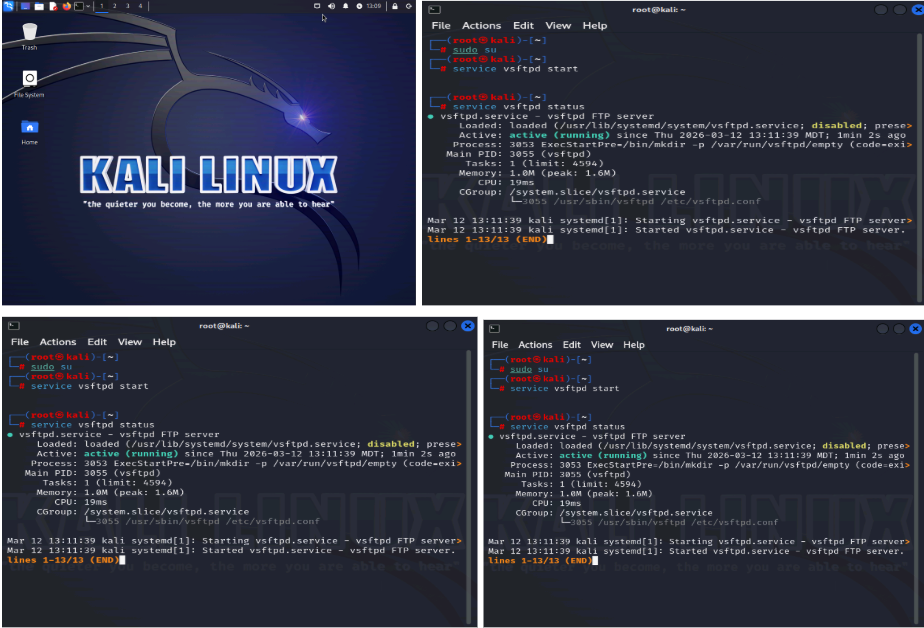

# Lab Project: Network Traffic Sniffing & Forensic Analysis
**Analyst:** Choiyon Chakraborty  
**Date:** March 16, 2026

## 1. Executive Summary
This project demonstrates a professional penetration testing engagement focused on capturing and analyzing live network traffic. The objective was to demonstrate the critical security risks associated with unencrypted protocols (HTTP and FTP) by intercepting sensitive credentials and high-value security assets in transit.

### Technical Toolkit
* **Operating System:** Kali Linux.
* **Traffic Interception:** `tcpdump` (Command Line Interface).
* **Protocol Analysis:** Wireshark (Graphical User Interface).
* **Target Services:** `vsftpd` (FTP Server) and OWASP Juice Shop (Web Application).

### Key Accomplishments & Skills Demonstrated
* **Live Traffic Interception:** Identified active network interfaces and executed targeted captures using Berkeley Packet Filters (BPF).
* **Protocol Optimization:** Utilized the `-nn` flag in `tcpdump` to disable name and port resolution, ensuring efficient raw data capture.
* **Deep Packet Inspection (DPI):** Applied Wireshark display filters to isolate HTTP POST requests and FTP command sequences.
* **Credential Recovery:** Successfully extracted plaintext login credentials from unencrypted JSON payloads and FTP handshake sequences.
* **Forensic Reconstruction:** Used **Follow TCP Stream** and **Follow HTTP Stream** to reconstruct full session transcripts and recover an intercepted SSL/CA Certificate file.

---

## 2. Detailed Lab Walkthrough

### Section 1: Initial Capture & Reconnaissance
This section documents the initial environment setup using **Kali Linux**. I elevated to root privileges to initialize the **vsftpd** FTP service and executed `tcpdump -D` to identify **eth0** as the primary active interface for traffic interception.

  

  

### Section 2: Targeted Traffic Capture
I demonstrated targeted capture using `tcpdump -nn` to disable name resolution, which optimizes processing speed during live analysis. I successfully captured an **ICMP Echo Request and Reply** sequence, confirming reliable bidirectional connectivity between the target host and the attacker machine.

  

### Section 3: Web Traffic & Credential Interception
In this phase, I targeted unencrypted web traffic on port **80** and saved the data to `juiceshop-web.pcap`. While the capture ran in the background, a user login attempt was simulated on an **OWASP Juice Shop** application instance.

Using **Wireshark**, I filtered the capture for **HTTP POST** methods to isolate authentication data. By inspecting the **Packet Bytes pane** of **Frame 431**, user credentials (`jaime@strucureality.com` and `Pa55word!`) were recovered in plaintext JSON format.

  

  

### Section 4: Session Reconstruction
I utilized the **Follow HTTP Stream** feature to reconstruct the full session transcript for clear-text review. This provided a clear view of the server's **401 Unauthorized** response, confirming the login attempt failed with the message: **"Invalid email or password."**.

  

### Section 5: FTP Exfiltration & Forensic Reconstruction
This capture demonstrates the high risk of using the **FTP protocol** without encryption. By filtering for the `ftp` protocol, I identified the plaintext transmission of sensitive commands, specifically recovering the **USER** (`kali`) and **PASS** (`Pa55w0rd!`) credentials.

  

### Section 6: Sensitive Asset Recovery
The final stage involved reconstructing a sensitive file transfer intercepted during the session. By following the **FTP-DATA** stream, I was able to extract the full content of an **Issuing CA Certificate (`.crt`)**, demonstrating a critical vulnerability where high-value security assets were compromised over an insecure channel.

  

  

